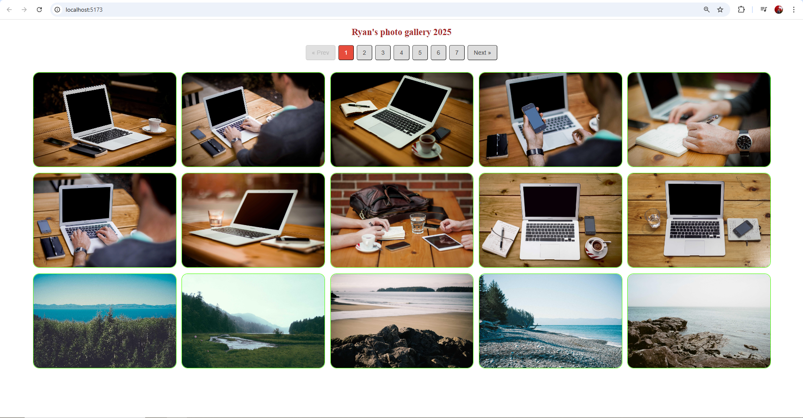
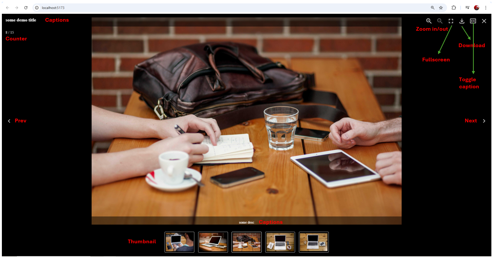

# Photo Gallery: React + Typescript + Vite

## Description:

Looking for a professional photo gallery with these features?

    ✅ Full-featured gallery experience:

    Click any photo to enter interactive mode

    Smooth zoom in/out functionality

    Detailed captions (titles & descriptions)

    Fullscreen viewing

    One-click downloads

    ✅ Optimized performance:

    All photos preloaded (no partial loading)

    Instant transitions between images

    Next/previous navigation

    ✅ Premium user experience:

    No "loading" artifacts

    Responsive on all devices

    Intuitive controls

👉 This is exactly what you've been searching for 😁😋😎 !

## Key features:

1. Basic pagination features

2. Use library **_yet-another-react-lightbox_** : create a **lightbox** to increase UX: supports keyboard, mouse, touchpad and touchscreen navigation

- Preloading: never displays partially downloaded images
- Performance: preloads limited number of images without compromising performance or UX
- Responsive: responsive images with automatic resolution switching are supported out of the box
- Video: video slides are supported via an optional plugin
- Zoom: image zoom is supported via an optional plugin
- Other plugins like:
  Counter: show total number of photos and current focusing photo
  Download:
  Fullscreen: turn on fullscreen mode
  Thumbnail: 5 small thumbnail photos below
  Slideshow...

## Screenshots:

