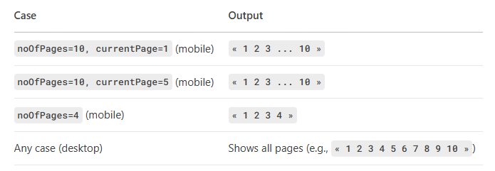
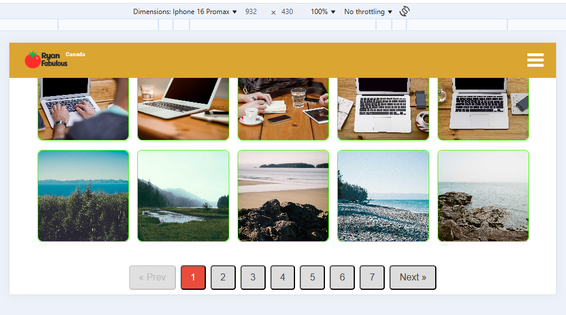
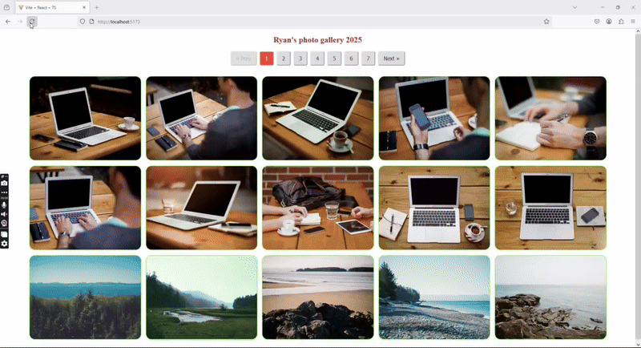

# Photo Gallery: React + Typescript + Vite

## Description:

Looking for a professional photo gallery with these features?

    ✅ Full-featured gallery experience:

    Click any photo to enter interactive mode

    Smooth zoom in/out functionality

    Detailed captions (titles & descriptions)

    Fullscreen viewing

    One-click downloads

    ✅ Optimized performance:

    All photos preloaded (no partial loading)

    Instant transitions between images

    Next/previous navigation

    ✅ Premium user experience:

    No "loading" artifacts

    Responsive on all devices

    Intuitive controls

👉 This is exactly what you've been searching for 😁😋😎 !

## Key features:

1. Basic pagination features (including reduce number of page btn displayed (add ellipsis) when swapping to mobile view)

2. Make this webpage responsive for Iphone 16 Promax (both Portrait and Landscape)

   Desktop view:

   

   Mobile view:

   

   

   

   

   

3. Use library **_yet-another-react-lightbox_** : create a **lightbox** to increase UX: supports keyboard, mouse, touchpad and touchscreen navigation

- Preloading: never displays partially downloaded images
- Performance: preloads limited number of images without compromising performance or UX
- Responsive: responsive images with automatic resolution switching are supported out of the box
- Video: video slides are supported via an optional plugin
- Zoom: image zoom is supported via an optional plugin
- Other plugins like:
  Counter: show total number of photos and current focusing photo
  Download:
  Fullscreen: turn on fullscreen mode
  Thumbnail: 5 small thumbnail photos below
  Slideshow...

## Screenshots:

## Pending issues:

- The preloading feature performs best on Firefox, but doesn't work as effectively on other browsers like Chrome or Opera, even after implementing caching to enhance rendering speed.

**1. Firefox performance**: Display a progressive render faster

**2. Chrome performance**: More aggressive about image quality, sometimes at the cost of initial render speed

